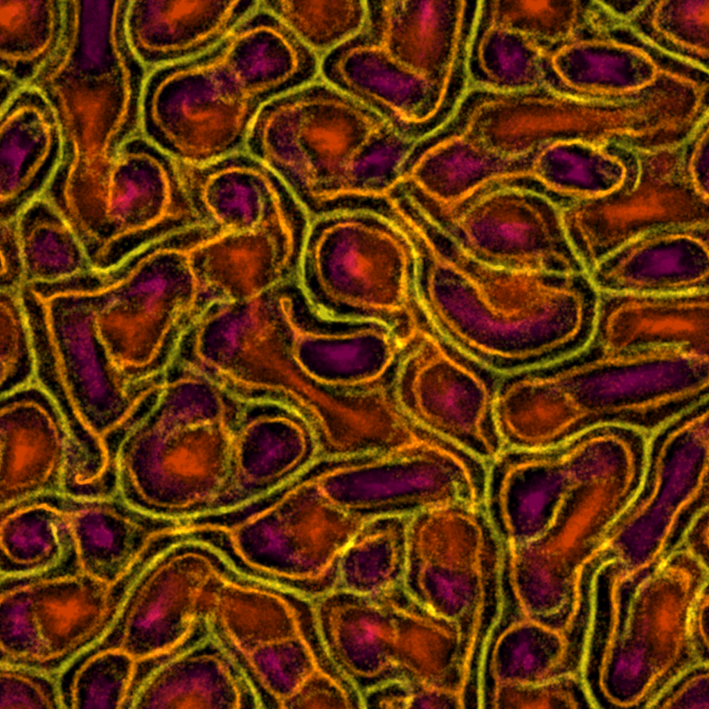

# Physarum Step by Step

Physarum slime mold simulation in Python — built step by step from scratch, from a single moving particle to emergent network behavior.




## Overview

[Physarum polycephalum](https://en.wikipedia.org/wiki/Physarum_polycephalum) is a slime mold that forms efficient transport networks. This project simulates that behavior using a simple agent-based algorithm:

1. **Sense** — each particle samples the trail map at three positions ahead (left, center, right)
2. **Rotate** — turn toward the strongest trail signal
3. **Move** — step forward in the current heading direction
4. **Deposit** — leave pheromone on the trail map at the new position
5. **Diffuse** — blur the trail map so pheromone spreads to neighbors
6. **Decay** — reduce trail values over time so old paths fade

This feedback loop produces emergent network structures that resemble biological transport networks.

Inspired by [Michael Fogleman's physarum](https://github.com/fogleman/physarum), an offline renderer written in Go.

## Getting Started

### Prerequisites

- Python >= 3.13
- [uv](https://github.com/astral-sh/uv) for dependency management

### Setup

```bash
# Clone the repository
git clone https://github.com/chhenning/physarum-step-by-step.git
cd physarum-step-by-step

# Install dependencies
uv sync

# Activate environment and set PYTHONPATH
source scripts/setup.sh
```

### Running

Each step is a self-contained script:

```bash
python src/step_01_single_particle.py
python src/step_06_emergence.py random    # spawn modes: random, ring, center, clusters
python src/step_16_final.py               # full interactive simulation
python src/step_17_offline.py             # headless high-res PNG output
```

## Step-by-Step Progression

| Step | File | Description |
|------|------|-------------|
| 01 | `step_01_single_particle.py` | Single particle on a grid with heading-based movement |
| 02 | `step_02_multiple_particles.py` | Multiple particles with random initialization |
| 03 | `step_03_trail_map.py` | Trail map: deposition and exponential decay |
| 04 | `step_04_diffusion.py` | Diffusion via 3x3 mean filter (double-buffered) |
| 05 | `step_05_sensors.py` | Sensors and chemotaxis (sense-rotate-move feedback loop) |
| 06 | `step_06_emergence.py` | Emergence with configurable spawn modes |
| 07 | `step_07_parameter_exploration.py` | Named presets demonstrating parameter effects |
| 08 | `step_08_pygame.py` | Pygame visualization (replaces ASCII with graphical rendering) |
| 09 | `step_09_numpy_vectorization.py` | NumPy vectorization (arrays + scipy diffusion) |
| 10 | `step_10_separable_box_blur.py` | Separable box blur (cumsum sliding window, configurable radius) |
| 11 | `step_11_dynamic_rendering.py` | Dynamic range rendering (percentile normalization, gamma correction) |
| 12 | `step_12_variable_step_distance.py` | Variable step distance with real-time keyboard controls |
| 13 | `step_13_multi_species.py` | Multi-species with separate trail grids, attraction/repulsion |
| 14 | `step_14_color_palettes.py` | 8 named color palettes, runtime cycling with P key |
| 15 | `step_15_weighted_sensing.py` | Probabilistic steering replaces hard conditionals |
| 16 | `step_16_final.py` | Final polish: random grid init, randomized species configs, R to regenerate |
| 17 | `step_17_offline.py` | Offline high-res rendering (~1M particles, Pillow PNG output) |
| 18 | `step_18_realtime.py` | Realtime Fogleman-style with optional GIF saving |

For the full tutorial guide and parameter tuning reference, see [`learning_path.md`](learning_path.md).

## Dependencies

- [pygame](https://www.pygame.org/) — real-time rendering
- [numpy](https://numpy.org/) — vectorized particle simulation
- [scipy](https://scipy.org/) — fast diffusion filters
- [pillow](https://python-pillow.org/) — high-res PNG output
- [imageio](https://imageio.readthedocs.io/) — GIF recording

## License

MIT — see [LICENSE](LICENSE) for details.
